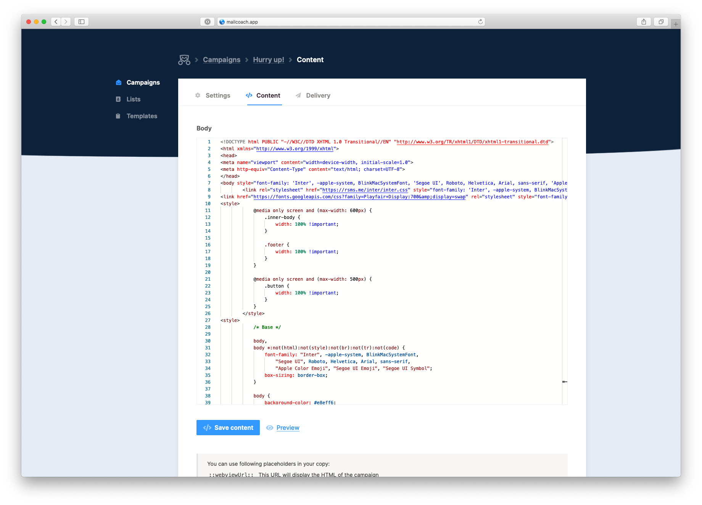

# Mailcoach Monaco Editor

A Monaco editor package for Mailcoach
    

## Documentation

You'll find the documentation for this package [inside the Mailcoach docs](https://mailcoach.app/docs/v2/package/customizing-the-editor/monaco).

## Changelog

Please see [CHANGELOG](CHANGELOG.md) for more information on what has changed recently.

## Contributing

Please see [CONTRIBUTING](CONTRIBUTING.md) for details.

## Security

If you discover any security related issues, please email freek@spatie.be instead of using the issue tracker.

## Credits

- [Rias Van der Veken](https://github.com/riasvdv)
- [All Contributors](../../contributors)

## License

The MIT License (MIT). Please see [License File](LICENSE.md) for more information.
